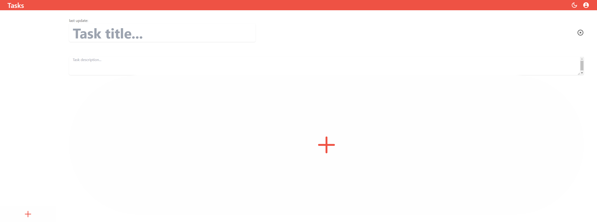
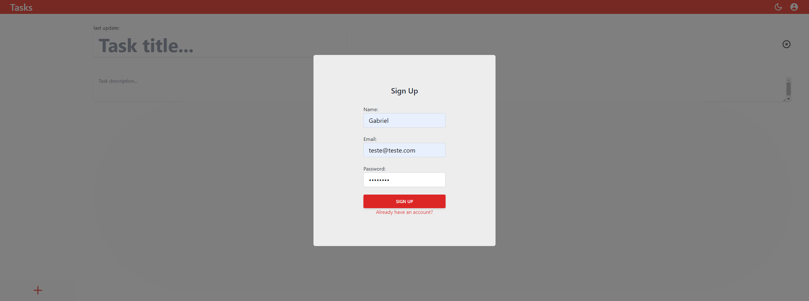
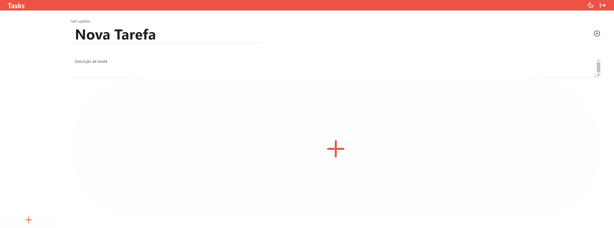
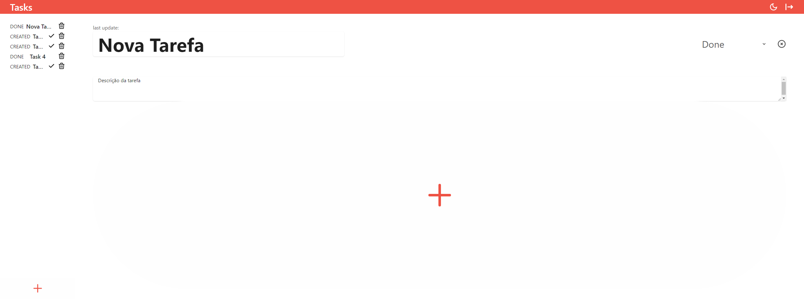

# Blitz Todo-List

Esse projeto foi construído para o evento de Blitz de Carreira da Trybe, sua proposta é ser uma aplicação Full-Stack para gerenciamento de tarefas, com organização monorepo.

## Table de Conteúdos

- [Visão geral](#visão-geral)
  - [O desafio](#o-desafio)
  - [Imagens](#imagens)
  - [Links](#links)
- [Meu processo](#meu-processo)
  - [Construído com](#construído-com)
  - [O que aprendi](#o-que-aprendi)
  - [Recursos úteis](#recursos-úteis)
- [Executando localmente](#executando-localmente)
    - [Com Docker](#com-docker)
    - [Sem Docker](#sem-docker)
- [Autor](#autor)

## Visão geral

### O desafio

A Blitz Todo-List é uma simulação de desafio técnico Full-Stack, no qual era necessário construir um CRUD completo com autenticação.

**Os usuários devem ser capaz de?**

- Registrar-se e Autenticar-se
- Criar tarefas
- Buscar tarefas
- Atualizar tarefas
- Deletar tarefas

### Imagens

<small>Documentação da API</small>





### Links

- URL da aplicação: https://blitz-todo-list.vercel.app

## Meu processo

### Construído com

#### Front-end

- TypeScript
- React _(Vite)_
- Axios
- React-Query
- Zustand
- TailWind CSS
- TalWind-Styled-Component

#### Back-end

- TypeScript
- Node.js
- Express.js
- JWT
- Prisma
- MySQL
- Mocha, Chai and Sinon

### O que aprendi

Puder reforçar meu conhecimentos em ambas as áreas, tanto Front-end quanto Back-end, com uma menção especial ao Front, pois pude aprender ferramentas novas e incrivelmente úteis para a resolução de problemas que havia tendo em projetos antigos.

Dois exemplos dessas ferramentas são o React-Query, extremamente simples e prático de ser utilizado para comunicação com a API e o Zustand, que possui a simplicidade do Context-API, aliada a performance do Redux para controle de estados.

### Recursos úteis

- [React-Query Documentação](https://react-query.tanstack.com/overview)
- [Zustand Documentação](https://github.com/pmndrs/zustand)

## Executando localmente

### Com Docker

Clona o repositório
```bash
git clone git@github.com:gabrielh-silvestre/blitz-todo-list.git
```

Entra no repositório
```bash
cd blitz-todo-list
```

Instala as dependências
```bash
npm install
```

Sobe os containers
```bash
docker-compose up -d
```

### Sem Docker

**É necessário ter o Node.js e o MySQL instalado localmente!**

Clona o repositório
```bash
git clone git@github.com:gabrielh-silvestre/blitz-todo-list.git
```

Entra no repositório
```bash
cd blitz-todo-list
```

Instala as dependências
```bash
npm install
```

Executa o `back-end` e o `front-end` manualmente
```bash
npm run dev
```

## Autor

- LinkedIn - [Gabriel Silvestre](https://www.linkedin.com/in/gabrielh-silvestre/)
- DevTo - [Gabriel_Silvestre](https://dev.to/gabrielhsilvestre)
